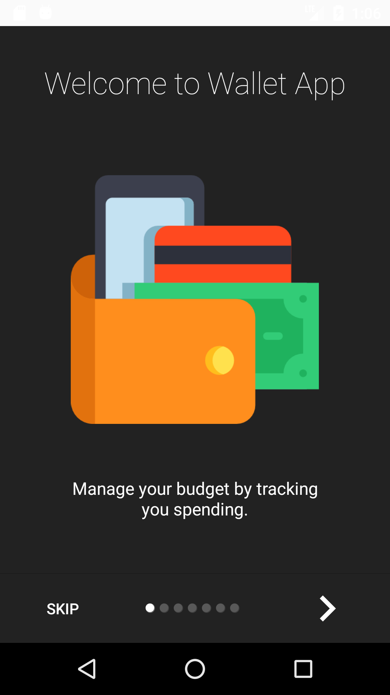
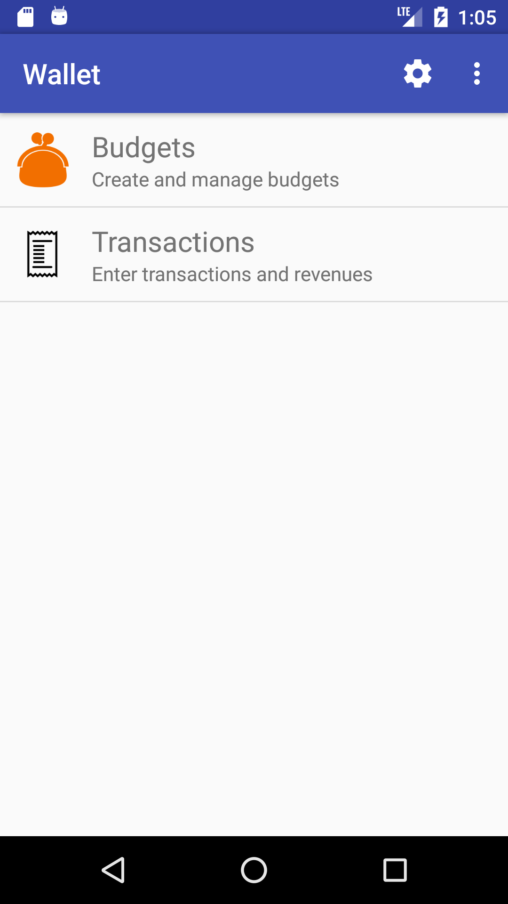
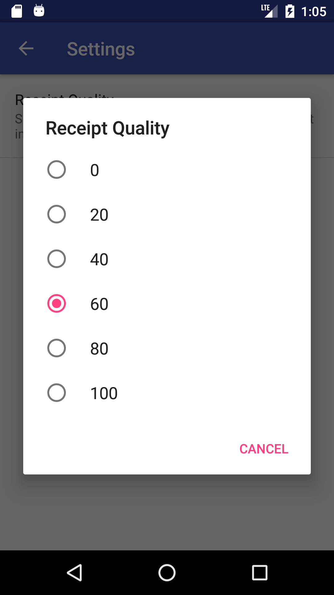

# Budget Manager

Budget Manager helps manage personal budgets. After adding your budgets, simply record your day-to-day transactions.
You can then view how close your sending is to your budget.

If there is any interest in improving this project, kindly submit a pull request with
proposed changes.

# Screenshots

# Building

To build, use the gradle wrapper scripts provided in the top level directory of the project. The following will
compile the application and run all unit tests:

# Thanks

App icons from [The Noun Project](https://thenounproject.com) and
[Icons8](https://icons8.com), specifically:
- [Purse](https://thenounproject.com/term/purse/26896/) by
[Dima Lagunov](https://thenounproject.com/lagunov.dmitriy/)
- [Ticket Bill](https://thenounproject.com/term/ticket-bill/634398/)
by [naim](https://thenounproject.com/naim.solis/)
- [Save](https://thenounproject.com/term/save/716011) by [Bernar Novalyi](https://thenounproject.com/bernar.novalyi)
-[icons] by [FlatUIicons]
